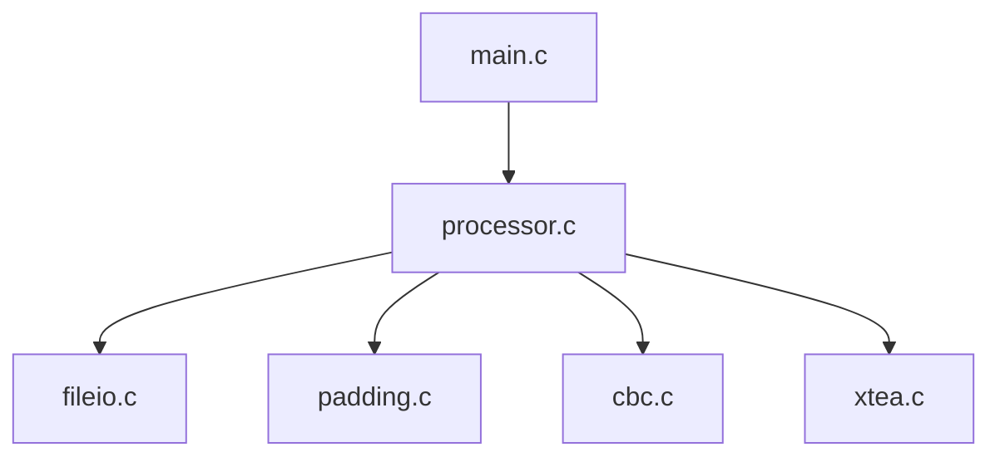
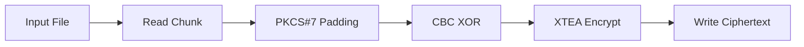
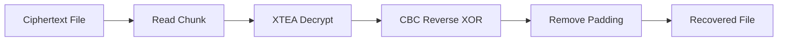
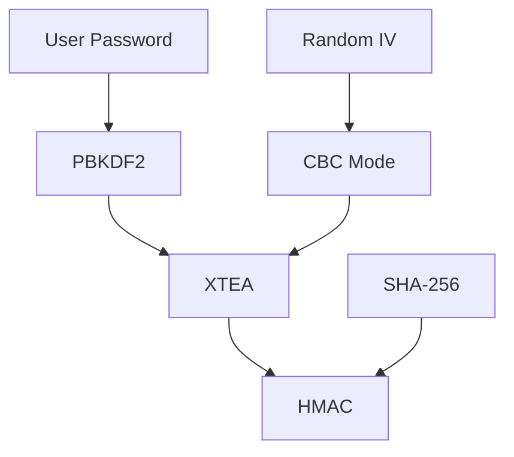

# SecureCrypt

### Educational File Encryption System in C

SecureCrypt is an educational cryptography project that demonstrates how a modern file encryption pipeline can be built from low-level components in C.

The project implements:

- XTEA block cipher
- CBC (Cipher Block Chaining) mode
- PKCS#7 padding
- Modular file processing
- Automated build system
- Unit and integration testing

The codebase is intentionally structured for learning, experimentation, and discussion rather than production deployment.

## Design Goals

This project was built to explore:

- Block cipher implementation
- Cipher mode construction
- Data packing and serialization
- Binary file processing
- Modular software architecture
- Build automation with Make
- Cryptographic testing methodologies

## Security Notice

SecureCrypt is an educational implementation.

While it successfully demonstrates encryption and decryption workflows, several security features commonly required in production-grade encryption software are still under development, including:

- PBKDF2 key derivation
- HMAC authentication
- Random IV generation
- File format versioning
- Tamper detection

### This project should be used for educational purposes only.

# Architecture

SecureCrypt follows a layered architecture that separates cryptographic primitives, file processing, and application logic.

This separation improves maintainability, testability, and allows individual components to evolve independently.

# Design Goals

The project was built to explore:

* Cryptographic system design
* Block cipher implementation
* Cipher mode construction
* Binary file processing
* Modular software architecture
* Build automation
* Software testing practices

The primary objective is educational value and engineering clarity rather than production deployment.

# Cryptographic Pipeline

Encryption follows a staged processing pipeline:

Decryption performs the reverse sequence to recover the original plaintext.

# Testing Philosophy

Testing is integrated throughout the project development process.

The codebase includes:

* Unit tests for individual components
* Integration tests for end-to-end workflows
* Infrastructure for future security testing
* Infrastructure for future stress testing

Testing focuses on correctness, reversibility, data integrity, and component isolation.

# Build System

The project uses a Makefile-driven build process.

Key goals include:

* Reproducible builds
* Automated dependency tracking
* Separation of source and build artifacts
* Scalable project organization

Build artifacts are generated in dedicated build directories to keep source code clean and organized.

# Engineering Focus Areas

This project explores several software engineering topics:

* Modular design in C
* Memory-safe data processing
* Cryptographic primitives
* Binary serialization
* File handling
* Automated builds
* Testing methodologies
* Debugging low-level systems software

# Roadmap

Future development may include:

* Password-based key derivation
* Cryptographic authentication
* Secure metadata handling
* Randomized initialization vectors
* File format versioning
* Tamper detection mechanisms
* Expanded test coverage
* Performance profiling and optimization

# Author

Built and maintained as an ongoing systems programming and cryptography project.

The project serves as a practical exploration of encryption system design, software architecture, testing methodologies, and low-level development in C.

Contributions, discussions, and feedback are welcome.
~AtharvM2411